University: [ITMO University](https://itmo.ru/ru/) 
Faculty: [FICT](https://fict.itmo.ru) 
Course: [IP-telephony](https://github.com/itmo-ict-faculty/ip-telephony) 
Year: 2024/2025 
Group: K34212 
Author: Kardakov Maxim Dmitrievich 
Lab: Lab1 
Date of create: 28.02.2025 
Date of finished: 28.02.2025 

# Отчёт о Лабораторной работе №2  "Конфигурация voip в среде Сisco packet tracer"

## Описание работы

Для выполнения данной лабораторной работы собирается схема соединения. Необходимо проверить, правильно ли подключены все узлы устройств. Предварительно удалить все преды- дущие конфигурационные файлы на маршрутизаторах Cisco 2811, на коммутаторе Cisco catalyst 3560.

## Цель работы

Изучить построение сети IP-телефонии с помощью маршрутизатора Cisco 2811, коммутатора Cisco catalyst 3560 и IP телефонов Cisco 7960.

## Ход работы

### Часть 1. Развёртка базовой схемы сети

В данной части мы будем работать со схемой, состоящей из маршрутизатора Cisco 2811, коммутатора Cisco Catalyst 3560 и двух IP-телефонов.
  
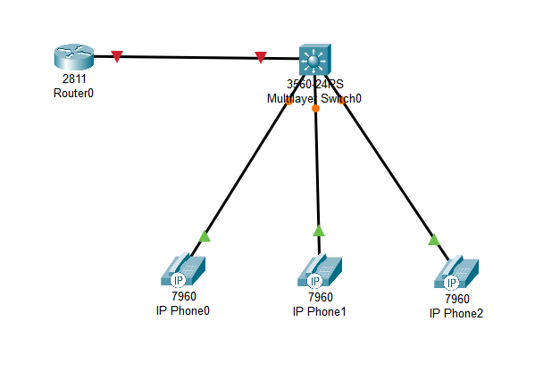  

#### 1. В конфигурационном режиме измените название маршрутизатора на CMERouter.

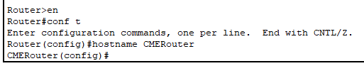 

#### 2. Отключите синтаксис ввода слов от DNS серверов.

Для того, чтобы оключить DNS-поиск, была введена команда `no ip domain-lookup`. Эта команда предотвращает задержки из-за попыток маршрутизатора разрешить случайно введененные команды как доменные имена.

#### 3. Задайте пароли для защиты маршрутизатора как в удаленном режиме, так и в режиме консоли.

На роутере необходимл было настроить пароли для консоли, для удаленного доступа (telnet) и для привилегированного режима (config).  

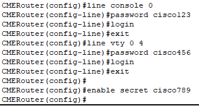   

После выполнения всех команд пароль запрашивался при попытке воспользоваться как привилегировнным режимом, так и в целом самой консолью.

#### 4. Настройте интерфейс fa0/0 на маршрутизаторе Cisco 2811 (CMERouter).

На роутере были настроены саб-интерфейсы для интерфейса FastEthernet0/0, где FastEthernet0/0.1 был выделен под данные, а FastEthernet0/0.2 - под голос.  

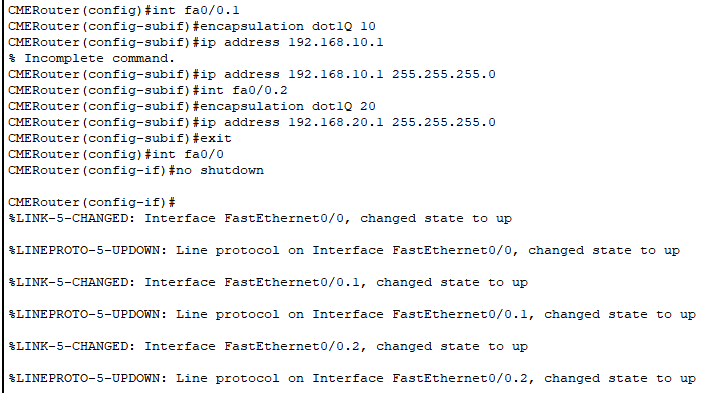 

#### 5. Настроить DHCP сервера для передачи голоса и данных на маршрутизаторе Cisco 2811.

Следующим этапом была настройка DHCP. Для этого в маршрутизаторе было создано два пула адресов: была указана сеть, дефолт-роутер, и, для голоса, был указан IP CME через option.  

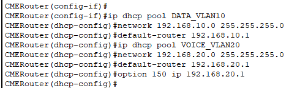 

#### 6. Настроить услуги телефонии Cisco CallManager Express на маршрутизаторе 2811.

Далее с помощью `telephony-service` был настроен CME: было указано максимальное количество телефонов, максимальное количество номеров, автоназначение номеров. Также были созданы 3 телефонных номера.  

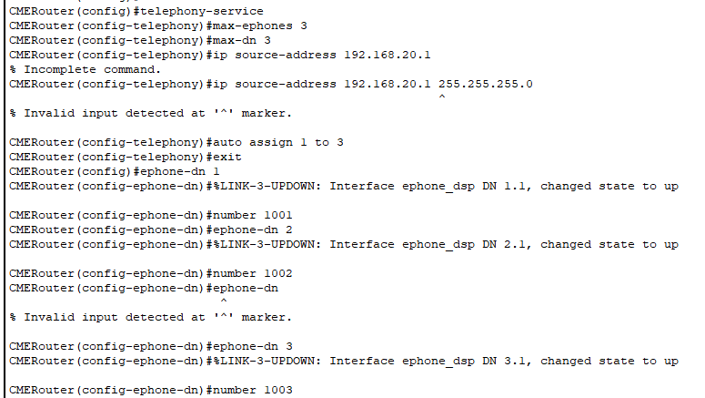 

#### 7. Создать VLAN порты на коммутаторе Cisco Catalyst 3560 для взаимодействия коммутатора с маршрутизатором и подключить IP телефоны.

После этого необходимо было настроить коммутатор:

1. Создать вланы
2. Настроить порты для телефонов
3. Настроить trunk-порт к маршрутизатору.

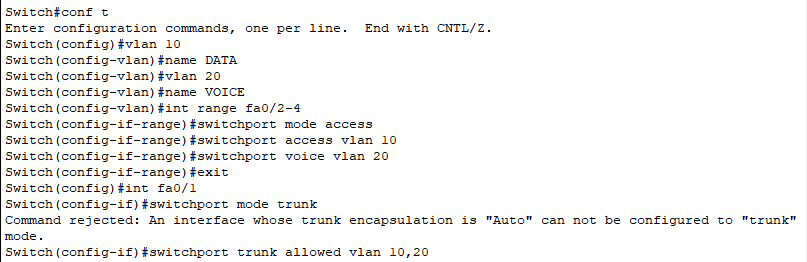   

Как мы можем видеть, возникла ошибка из-за модели коммутатора, так как на коммутаторе не была указана инкапсуляция VLAN. Команда была переписана.  

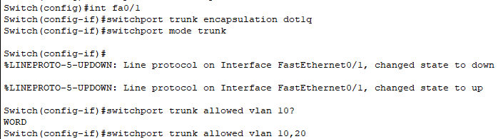 

#### 8. Настроить IP-телефоны и соединить с коммутатором Cisco Catalyst 3560.

По-началу телефоны не хотели регистрироваться, но ошибка быстро выявилась через `show running-config`: в `telephony-service` не был указан ip source-address, то есть не было указано, где находится CME. После выполнения соответсвующей команды, телефоны успешно было зарегистрированы.  

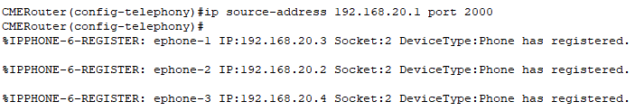 

#### 9. Проверить звонки между телефонами и проверить остальные сервисы (перевод звонков, конференц-связь, перехват звонка).

Связь между телефонов была успешно проверена звонком между телефонами с номером 1001 и 1003  

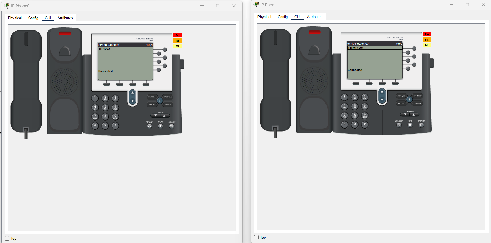 

### Часть 2. 

Далее в существующую систему необходимо было добавить 3 новых конечных устройства (компьютера) напрямую через IP-телефоны.   

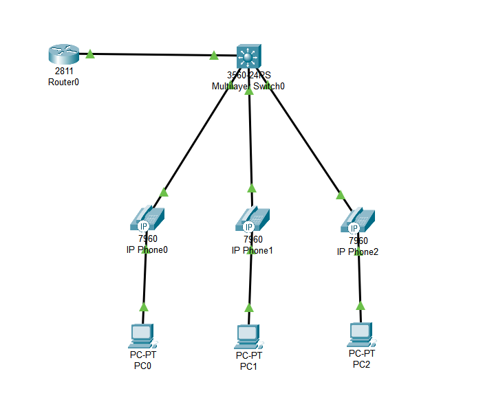   

Так как в 1 части работы мы уже настроили DHCP и разделили VLAN на 10 и 20, где 10 отвечат за данные, а 20 за голос, компьютеры сразу же должны получить IP через DHCP от маршрутизатора.  

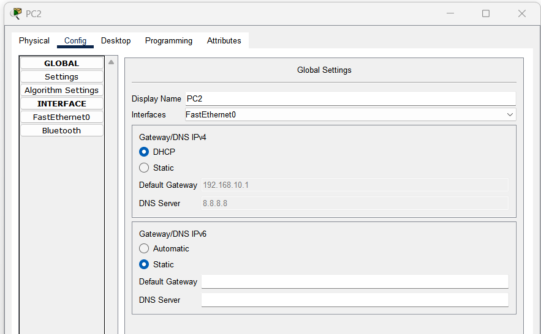   

Был проверен пинг и ещё раз проверен вызов с телефона на телефон: всё успешно сработало, система позволяет одновременно пользоваться телефонами и компьютерами.  

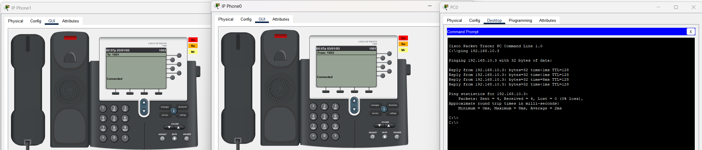 

### Итоговая схема
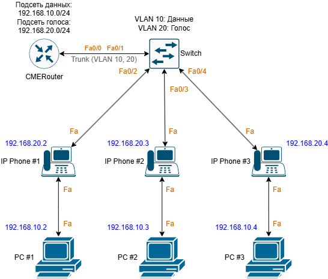 

## Вывод

В данной работе была создана схема сети, предоставляющее одновременное взаимодейтсиве между компьютерами и телефонами в разных VLAN. 